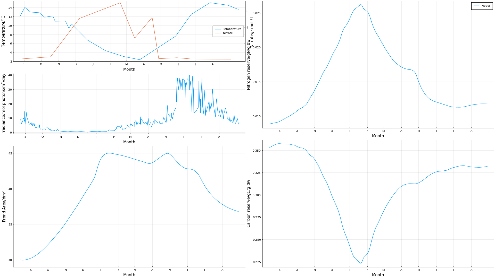

# Kelp.jl
[Kelp.jl](https://github.com/jagoosw/Kelp.jl) is an implementation of the sugar kelp growth model from [Broch and Slagstad model of the growth and composition of _Saccharina latissima_  Kelp](https://link.springer.com/article/10.1007/s10811-011-9695-y).

# Contents

```@contents
Pages = [
    "functions.md",
]
Depth = 1
```


# Getting Started
## Current dependencies
- RecursiveArrayTools
- DiffEqBase
- OrdinaryDiffEq
- Roots
- Interpolations
- DataFrames
- Plots
- Dates
- Measures
- CSV
- LaTeXStrings

Install them all with:

`import Pkg; Pkg.add(["RecursiveArrayTools", "DiffEqBase", "OrdinaryDiffEq", "Roots", "Interpolations", "DataFrames", "Plots", "Dates", "Measures", "CSV", "LaTeXStrings"])`

You can possibly also be able to run `import Pkg` then `[dev Kelp` from the directory below this repository. 
## Running a model

```
include("Kelp/src/Kelp.jl")
```
Define the required parameters, in this example the parameters "provided" in Broch and Slagstad 2012. Firstly the constants:
```
offset = 4*31+28+30*2.0
t_i = offset+12
nd = 365+16
lat = 60.257
```
The first, `offset`, is used here to align the environmental data with the start of the year. We then have `t_i` which is the start time in days since January 1st (of whatever year the environmental data starts). `n_d` is the number of days to run for and `lat` is latitude (used to calculate the length of the day). Next load the input data:

```
using CSV

temp_file=CSV.read("examples/bs2012/temp.csv",DataFrame); sort!(temp_file); temp_t=temp_file.day; temp=temp_file.temp
no3_file=CSV.read("examples/bs2012/no3.csv",DataFrame); sort!(no3_file); no3_t=no3_file.day; no3=no3_file.no3
irr_file=CSV.read("examples/bs2012/irr.csv",DataFrame); sort!(irr_file); irr_t=irr_file.day; irr=irr_file.irr
temp_t .+= offset; no3_t .+= offset; irr_t .+= offset
```
The model takes interpolation objects for the environmental parameters (irradiance, temperature and nitrate concentration) so that the dates time steps vs the models can be arbitrary. They also need to be in units `mol photons per square meter per day`, `degrees centigrade` and `millimoles of Nitrate per cubic meter`. Generate the interpolations like this:
```
temp_arr = Interpolations.LinearInterpolation(temp_t, temp, extrapolation_bc=Flat())
no3_arr = Interpolations.LinearInterpolation(no3_t, no3, extrapolation_bc=Flat())
irr_arr = Interpolations.LinearInterpolation(irr_t, irr, extrapolation_bc=Flat())
```
You may not want the boundaries to extrapolate.

The current speed can also be time varying but to make it constant use:
```
u = 0.15
u_arr = Interpolations.LinearInterpolation([t_i:t_i + nd;], fill(u, Int(nd + 1)))
```
Finally, define the initial conditions (`a_0`=initial area in $dm^2$, `n_0`=initial fraction of nitrogen reseve and `c_0`=initial fraction carbon reserve) and run the model:
```
a_0 = 30;n_0 = 0.01;c_0 = 0.6

solution, results = Kelp.solvekelp(t_i, nd, u_arr, temp_arr, irr_arr, no3_arr, lat, a_0, n_0, c_0, "../src/parameters/origional.jl")
```
Here the final parameter `"../src/parameters/origional.jl"` is specifying to use the model parameters from the 2012 paper, alternatively you can use `"../src/parameters/2013.jl"`. You can also use the adjusted respiration model from the 2013 paper by adding a parameter with the value of `2`.

The following code produces a plot of all the input and output parameters (as shown below):
```
using Plots
pyplot()
l = @layout [[a{0.25h};b{0.25h};c{0.5h}] grid(2, 1)]
plot(layout=l)

plot!(temp_t,temp,sp=1,ylabel=L"Temperature/$^o$C",xlabel="Month",legend=false,label="Temperature")
plt = twinx()
plot!([no3_t[1],no3_t[1]],[no3[1]no3[1]],sp=6,label="Temperature")
plot!(no3_t,no3,sp=6,ylabel=L"Nitrate/$\mu$ mol / L",legend=:right,label="Nitrate")
plot!(irr_t,irr,sp=2,ylabel=L"Irradiance/mol photons/m$^2$/day",legend=false,xlabel="Month")

# structural to dry weight conversion (paper plots g/g dry weight where as g/g structural weight is used in calculations)
n_factor = (results.nitrogen .- N_min) .* K_N
c_factor = (results.carbon .- C_min) .* K_C
w_factor = 1 .+ n_factor .+ c_factor .+ C_min .+ N_min

plot!(results.time,results.area,sp=3,xlabel="Month", ylabel=L"Frond Area/dm$^2$",ylim=(29, 46),label="Model",legend=false)

plot!(results.time,(results.nitrogen .+ N_struct) ./ w_factor,sp=4, xlabel="Month", ylabel="Nitrogen reserve/gN/g dw",label="Model")

plot!(results.time,(results.carbon .+ C_struct) ./ w_factor,sp=5, xlabel="Month", ylabel="Carbon reserve/gC/g dw",label="Model",legend=false)

t_ticks = []
val_ticks = []
for day in t_i:t_i + nd
    date = Date(1981, 1, 1) + Dates.Day(day)
    if Dates.format(date, "d") == "1"
        push!(t_ticks, day)
        push!(val_ticks, Dates.format(date, "U")[1])
    end
end

plot!(xticks=(t_ticks, val_ticks))
display(display(plot!()))
```
 

# Model Verification
The models outputs compared with figure 3 in Broch and Slagstad 2012 are shown below:

The discrepancies may be down to the inaccuracy of reporting of the model parameters or the difficulty extracting the input data from the paper. 

Changes to the parameters from those published are detailed [here](https://github.com/jagoosw/Kelp/blob/master/changes.pdf).